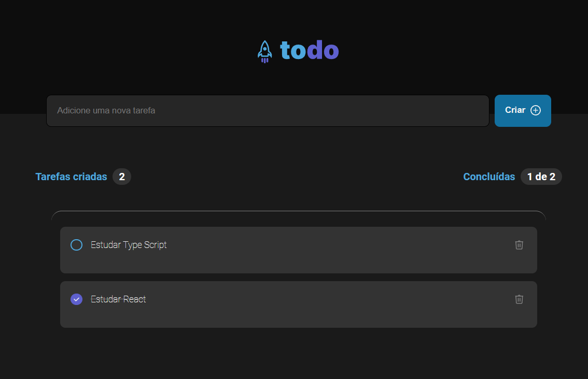

<h1 align="center">
  
</h1>

<p align="center">
  <a href="#-Technologies"><b>Technologies</b></a>&nbsp;&nbsp;&nbsp;|&nbsp;&nbsp;&nbsp;
  <a href="#-Project"><b>Project</b></a>&nbsp;&nbsp;&nbsp;
</p>

<br></br>

<div align="center">
  
</div> 

<br></br>

## 🚀 Getting started

Clone the project and access the folder.

```bash
$ git clone 
$ cd 
```

## Installation

```bash
$ npm install
```

## Running the app

```bash
$ npm run dev
```

<br></br>

## 💻 Technologies

This project was developed with the following technologies:
<b>
- Reactjs
- Type Script
- Java Script
</b>

## 📄 Project
💰 .

<br></br>

Made with ♥ by Pedro Dias. 👋 Follow me on social media!<br></br>

If you can give a little star, I appreciate it 🤩
